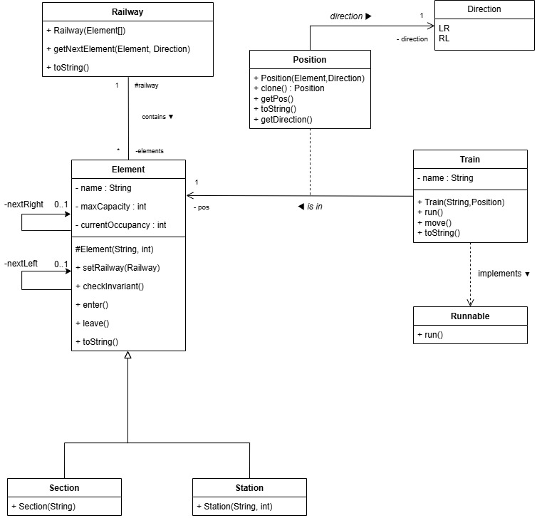

# Trains et circuits

https://docs.google.com/document/d/1O3DqGUDj2hL5yDSUT-t1YE0CvUXdrPYanSlvILuaeLg/edit?usp=sharing

# REFAIRE DIAGRAMME DE CLASSE

## Auteurs

- MARBOEUF Kéwan
- NEHLIL Kamel
- WANG Mélina

## Exercice 1

### Question 1.1
Dans la réalisation d'un déplacement d'un train, les classes ont les rôles suivants :

- `Railway`: Cette classe représente l'entièreté du chemin de fer, il comprend tous les éléments, les stations, les sections de rails et les endroits où se trouvent les trains, il possède une méthode `toString` qui permet d’afficher l'état réel du réseau.
- `Element`: C’est la classe parent de `Section` et de `Station` qui sont les 2 types d'éléments de notre réseau. Dans une section il peut, ou non, y avoir un Train.
- `Section`: Une simple section de rail
- `Station`: Cette classe prend un entier en plus de son nom (`String`). Cet entier représente le nombre de train que peut accueillir la station simultanément.
- `Position`: La classe position permet de relier un train à un élément. Elle indique dans quelle `Direction` (droite ou gauche) il va et dans quel `Element` il se trouve. 
- `Train`: La classe `Train` est une classe qui permet de définir un train sur le réseau, il porte un nom et se trouve a une certaine `Position`.

### Question 1.2
Après ajout des méthodes, et attributs, nécessaires à la réalisation du déplacement d'un train, nous obtenons le diagramme de classe suivant : 

## Exercice 2

### Question 2.2

D'après l'énoncé, l'invariant de sureté est défini par : 
- Les trains qui circulent dans le même sens ne se doublent pas : il faut garantir qu’il y a au
maximum un train dans une section 
- Si un train est en déplacement dans un sens, aucun autre train n’est en déplacement dans le sens contraire.

Les variables qui permettent d'exprimer l'invariant de sûreté de trains sont donc :
- Pour la première condition : `currentOccupancy` et `maxCapacity` avec `maxCapacity = 1` dans le cas d'une section  
- Pour la deuxième condition : `nbTrainsLR` et `nbTrainsRL`

### Question 2.3

En termes de variables, on peut exprimer l'invariant de sûreté de la manière suivante :  
$(0 <= currentOccupancy ∧ currentOccupancy <= maxCapacity) ∧ (nbTrainsLR = 0 ∨ nbTrainsRL = 0)$

### Question 2.4

Comme actions "critiques", le train peut entrer ou sortir d'un élément (section ou gare). Ce sont ces actions qui ont un impact sur l'invariant de sûreté.

### Question 2.5

Ces actions doivent être ajoutées dans la classe `Element`, être appelées dans `Train` et synchronisées avec `Railway`.

### Question 2.6

Selon la méthode de construction d'une solution de synchronisation donnée plus haut, il faudrait une méthode `invariant()` qui renvoie un boolean pour savoir si le train peut entrer sur les rails : si ce n'est pas le cas, on utilise un `wait()` ainsi qu'un `notifyAll()` après chaque modification de l'état.

## Exercice 3

### Question 3.1

On cherche à empêcher les sorties de gare si des trains dans l'autre sens sont sur la ligne. Pour cela, on introduit des compteurs globaux :
- `nbRunningLR / RL` : Nombre de trains actuellement dans des sections pour chaque direction
- `nbWaitingLR / RL` : Nombre de trains en attente en gare souhaitant partir dans une direction donnée

L'invariant de sûreté pour sortir d'une gare est :
- Absence de conflit : Aucun train ne doit circuler dans le sens opposé (nbRunning(opposite) == 0)
- Garantie de place (Réservation) : La capacité de la gare de destination doit être suffisante pour accueillir tous les trains déjà en route ainsi que ceux qui attendent de partir dans la même direction 

### Question 3.2

Cette nouvelle condition pour l'invariant s'exprime donc de la manière suivante :  
$$Capacity(Dest) \ge (RunningTrains + WaitingTrains)$$

### Question 3.3

C'est `Railway` qui est responsable de ces variables car c'est cette classe qui a une vue d'ensemble du circuit.